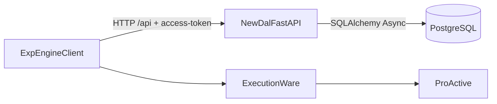
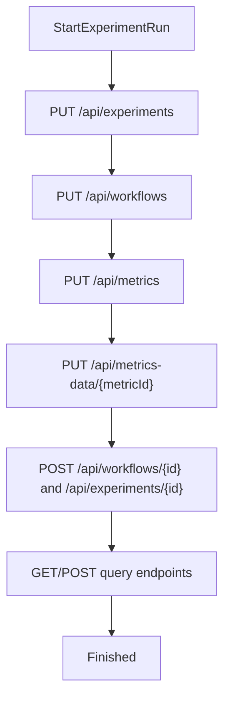
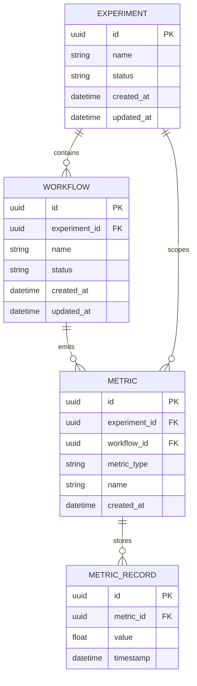

# NEW DAL Documentation

This guide documents the NEW DAL implementation only:

- FastAPI service
- PostgreSQL persistence
- Engine-compatible API behavior
- Local installation and Docker deployment

No OLD/legacy DAL instructions are included in this file.

## Architecture



## Data Lifecycle Flowchart



## ER Diagram (Core Entities)



## Installation (Local)

### Prerequisites

- Python 3.12+
- PostgreSQL 15+
- Git
- Docker + Docker Compose (recommended for local infra)

### Setup

```bash
git clone https://github.com/xampos101/DAL.git
cd DAL
python -m venv .venv
```

PowerShell:

```powershell
.\.venv\Scripts\Activate.ps1
```

Install dependencies:

```bash
pip install -r requirements-test.txt
pip install "uvicorn[standard]"
```

Create local environment file:

```env
DATABASE_URL=postgresql+asyncpg://<DB_USER>:<DB_PASSWORD>@127.0.0.1:5432/<DB_NAME>
ACCESS_TOKEN=<DAL_ACCESS_TOKEN>
```

Run the API:

```bash
uvicorn dal_service.main:app --host 0.0.0.0 --port 8000 --reload
```

Verify:

```bash
curl -H "access-token: <DAL_ACCESS_TOKEN>" http://127.0.0.1:8000/api/health
curl -H "access-token: <DAL_ACCESS_TOKEN>" http://127.0.0.1:8000/api/experiments
```

## Docker Installation / Deployment

### `.env.example`

```env
POSTGRES_DB=<POSTGRES_DB>
POSTGRES_USER=<POSTGRES_USER>
POSTGRES_PASSWORD=<POSTGRES_PASSWORD>
DATABASE_URL=postgresql+asyncpg://<POSTGRES_USER>:<POSTGRES_PASSWORD>@postgres:5432/<POSTGRES_DB>
ACCESS_TOKEN=<DAL_ACCESS_TOKEN>
```

### `docker-compose.yml` (single stack)

```yaml
services:
  postgres:
    image: postgres:15
    environment:
      POSTGRES_DB: ${POSTGRES_DB}
      POSTGRES_USER: ${POSTGRES_USER}
      POSTGRES_PASSWORD: ${POSTGRES_PASSWORD}
    ports:
      - "5432:5432"
    volumes:
      - postgres_data:/var/lib/postgresql/data

  dal:
    build: .
    environment:
      DATABASE_URL: ${DATABASE_URL}
      ACCESS_TOKEN: ${ACCESS_TOKEN}
    depends_on:
      - postgres
    ports:
      - "8000:8000"

volumes:
  postgres_data:
```

### Runbook

```bash
docker compose up -d --build
docker compose ps
docker compose logs -f dal
```

Stop:

```bash
docker compose down
```

Reset (destructive):

```bash
docker compose down -v
```

## Security Notes

- Never commit real tokens or database credentials.
- Keep `.env` local and gitignored.
- Use placeholders in all shared documentation.
- Rotate token immediately if exposure is suspected.
