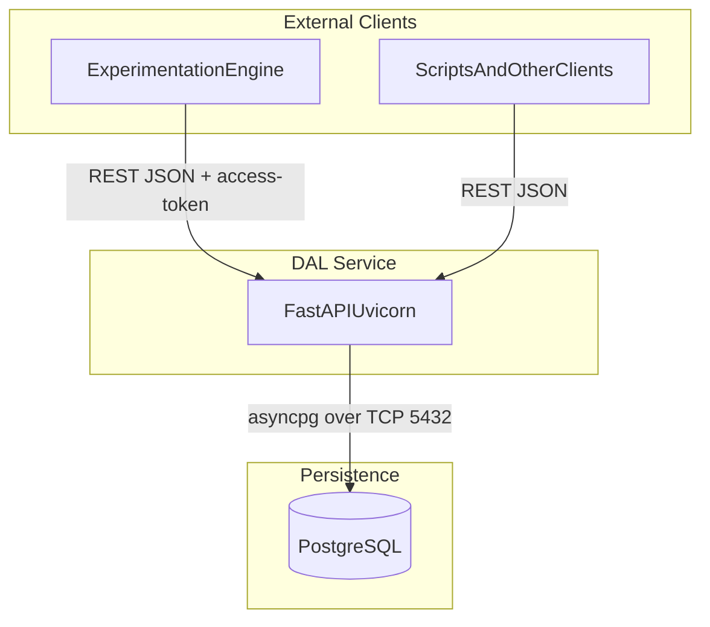
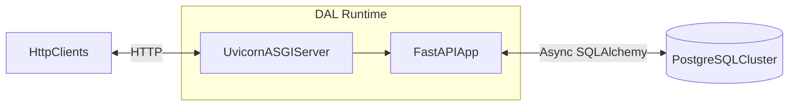
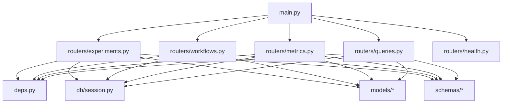
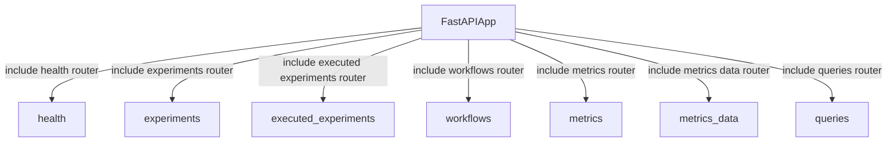
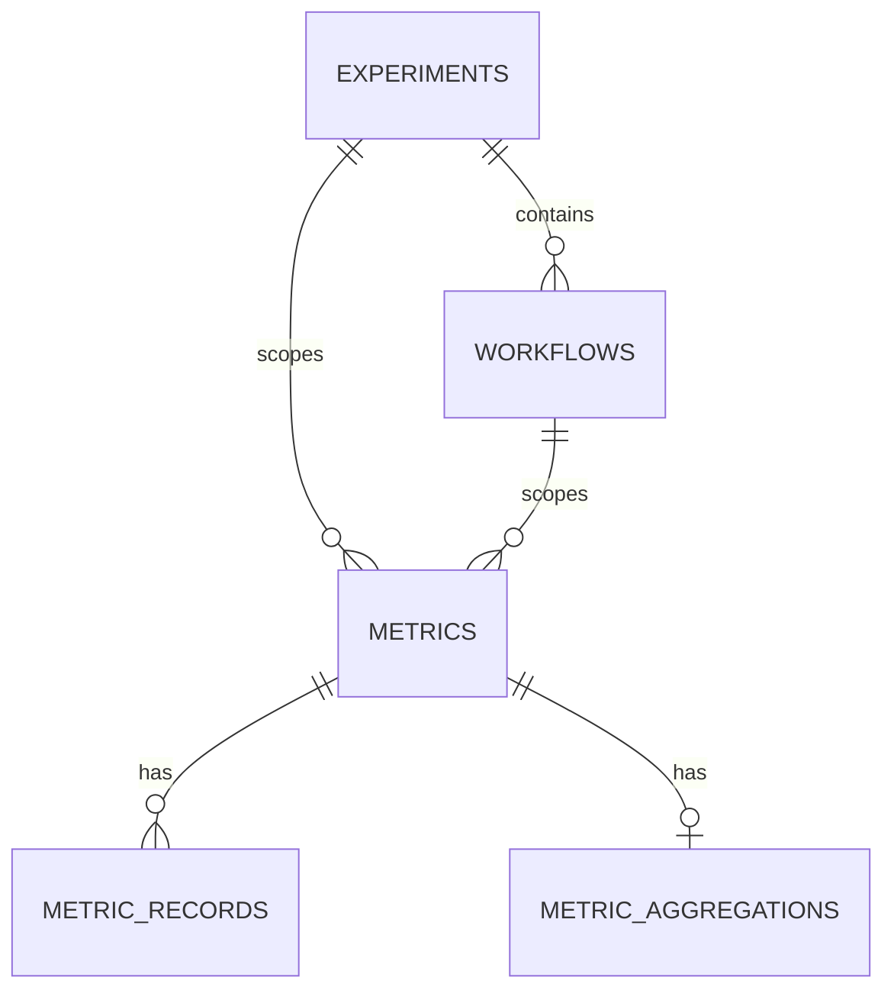
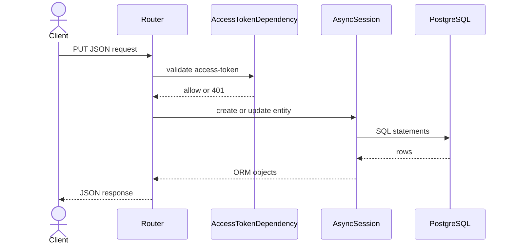
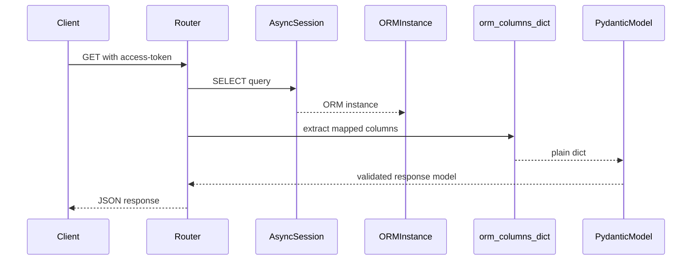

# DAL Architecture Diagrams

Architecture reference for the ExtremeXP Data Abstraction Layer (FastAPI + PostgreSQL).
All diagrams are Mermaid-compatible and can be rendered in GitHub/Cursor.

---

## A. System Context

## B. Runtime Container View

## C. Internal Components

## D. API Registration (`/api` prefix)

## E. Logical Entity Model

## F. Write Sequence (Create Endpoint)

## G. Read Sequence (Safe Model Validation)

