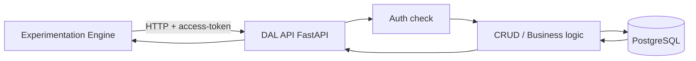
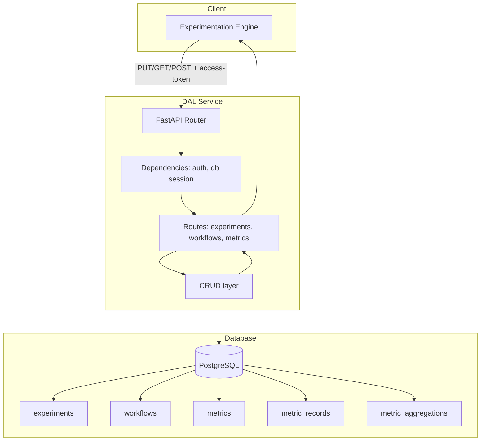

# DAL – Διάγραμμα ροής δεδομένων

Πώς ρέουν τα δεδομένα από το Experimentation Engine στο DAL και στη βάση.

---

## Request lifecycle (high-level)

---

## Flow: Engine → DAL → PostgreSQL

---

## Παράδειγμα: Create experiment

1. **Engine** κάνει **PUT /api/experiments** με body `{ name, intent, ... }` και header **access-token**.
2. **DAL** ελέγχει token (dependency)· αν invalid → 401.
3. **Route** δέχεται body, καλεί **CRUD create_experiment(db, data)**.
4. **CRUD** ανοίγει transaction, εισάγει row στο **experiments**, κάνει commit (ή rollback on error).
5. **Route** επιστρέφει **201** και `{ "message": { "experimentId": "<uuid>" } }`.
6. **Engine** λαμβάνει το `experimentId` και το χρησιμοποιεί για επόμενα requests (π.χ. create workflow).

---

## Παράδειγμα: List experiments (executed-experiments)

1. **Engine** καλεί **GET /api/executed-experiments** με **access-token**.
2. **DAL** επαληθεύει token, καλεί **CRUD get_all_experiments(db)** (ή ισοδύναμο).
3. **CRUD** κάνει SELECT από **experiments** (με optional filters).
4. **Route** επιστρέφει **200** και `{ "executed_experiments": [ ... ] }`.
5. **Engine** χρησιμοποιεί το array για εμφάνιση/επιλογή experiments.

---

## Σημειώσεις

- Όλες οι κλήσεις προς το DAL περνούν από **auth** (access-token). Χωρίς valid token δεν γίνεται πρόσβαση στα δεδομένα.
- Οι αλλαγές στη βάση γίνονται μέσω **transactions**· σε σφάλμα γίνεται rollback.
- Το **database_schema.sql** ορίζει τους πίνακες· το **Alembic** εφαρμόζει το schema με migrations (από το ίδιο DDL).
