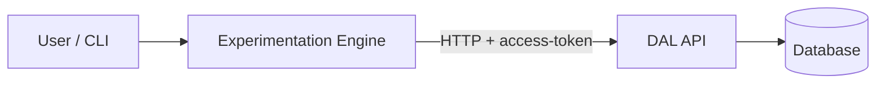

# ExtremeXP DAL – Αρχιτεκτονική, API Contract και απλή εξήγηση

Αυτό το έγγραφο συγκεντρώνει την επισκόπηση αρχιτεκτονικής, το σχήμα βάσης δεδομένων, τα API contracts (experiments, workflows, metrics), τη συμπεριφορά του Engine client, σημειώσεις συμβατότητας και μια απλή εξήγηση του DAL.

---

## Part 1 – Επισκόπηση αρχιτεκτονικής

### Κύρια στοιχεία του DAL

Το **DAL** (Data Abstraction Layer) είναι ένα REST API που αποθηκεύει και εξυπηρετεί metadata πειραμάτων, πληροφορίες workflows και μετρήσεις για το ExtremeXP Experimentation Engine.

| Στοιχείο | Ρόλος |
|-----------|------|
| **expvis (API server)** | Εφαρμογή Express που εξυπηρετεί REST API κάτω από `/api`. Θύρες: 8443 (trusted), 8444 (sandbox), **8445 (API)**. |
| **Experiments API** | CRUD (Δημιουργία, Ανάγνωση, Ενημέρωση, Διαγραφή) + query για experiments (name, intent, status, workflow_ids). Επιστρέφει `message.experimentId` στη δημιουργία. |
| **Workflows API** | CRUD + query για workflows (tasks, parameters, datasets, metrics). Επιστρέφει `workflow_id` στη δημιουργία. |
| **Metrics API** | CRUD + query + `PUT /metrics-data/{id}` για προσθήκη εγγραφών. Υποστηρίζει aggregations (π.χ. sum, median). |
| **DMS (προαιρετικό)** | `services/dms/` – μετατροπή DSL σε JSON (π.χ. bash script). Χρησιμοποιείται στο GET experiment όταν το `model` είναι ορισμένο και η env `DMS_PATH` υπάρχει. |

### Τεχνολογικό stack (τρέχουσα υλοποίηση Node.js)

- **Runtime:** Node.js, Express.
- **Κύριο αποθετήριο δεδομένων:** **Elasticsearch** – τα experiments, workflows και metrics αποθηκεύονται ως έγγραφα (indexes: `experiments`, `workflows`, `metrics`). Με αυτό επικοινωνεί το Engine.
- **Δευτερεύον αποθετήριο:** **MariaDB** (MySQL) – χρησιμοποιείται από τα Knex migrations μόνο για οπτικοποίηση/IDE: models, permissions, shares, systemVisualisation. Δεν χρησιμοποιείται για experiments/workflows/metrics.
- **Sessions:** Redis (π.χ. connect-redis).
- **Αναφορά:** Το αρχικό DAL βρίσκεται στο `DAL/extremexp-dal-main/`· οι API routes στο `server/routes/api/` (experiments.js, workflows.js, metrics.js).

### Πώς αλληλεπιδρά το Engine με το DAL

- Το Engine χρησιμοποιεί HTTP REST: GET, PUT, POST στη βασική URL του DAL (π.χ. `https://api.dal.../api`).
- Κάθε αίτημα στέλνει το header **`access-token`** (τιμή από το config).
- Τυπική ροή κατά την εκτέλεση πειράματος:
  1. **PUT /experiments** → δημιουργία experiment → λήψη `experimentId`.
  2. **POST /experiments/:id** → προαιρετική ενημέρωση experiment (π.χ. αφού επισυνάπτονται workflows).
  3. **PUT /workflows** (με `experimentId` στο body) → δημιουργία workflow(s) → λήψη `workflow_id`.
  4. **PUT /metrics** (με `parent_id` = workflow id, `parent_type` = "workflow") → δημιουργία metrics.
  5. **GET /workflows/:id**, **POST /workflows/:id** → ανάγνωση/ενημέρωση κατάστασης workflow και task outputs κατά τη διάρκεια και μετά την εκτέλεση.

### Βασικοί φάκελοι

- **DAL (αναφορά):** `DAL/extremexp-dal-main/server/routes/api/` – experiments.js, workflows.js, metrics.js.
- **DAL migrations:** `DAL/extremexp-dal-main/server/knex/migrations/` – σχήμα MariaDB για models/οπτικοποίηση.
- **Engine client:** `extremexp-experimentation-engine-main/exp_engine/src/eexp_engine/data_abstraction_layer/data_abstraction_api.py`.
- **OpenAPI spec:** `DAL/extremexp-dal-main/openapi.yaml`.

---

## Part 2 – Σχήμα βάσης δεδομένων (DAL)

Το τρέχον DAL χρησιμοποιεί **δύο ξεχωριστά αποθετήρια**. Αυτό με το οποίο ασχολείται το Engine είναι το Elasticsearch· το MariaDB χρησιμοποιείται μόνο για λειτουργίες οπτικοποίησης/IDE.

### Elasticsearch (κύριο – χρησιμοποιείται από το Engine)

- **Δεν υπάρχει CREATE TABLE** – τα δεδομένα είναι έγγραφα με `_id` και `_source`.
- **Indexes:**
  - **experiments** – έγγραφα experiment (name, intent, status, workflow_ids, creator, metadata, κ.λπ.).
  - **workflows** – έγγραφα workflow (experimentId, name, status, tasks, parameters, input_datasets, output_datasets, metric_ids, metrics, κ.λπ.).
  - **metrics** – έγγραφα metric (name, type, kind, value, records, producedByTask, parent_id, parent_type, experimentId, κ.λπ.).
- Όλες οι λειτουργίες create/read/update για experiments, workflows και metrics πηγαίνουν στο Elasticsearch (index, get, search, update).

### MariaDB (Knex – μόνο οπτικοποίηση)

Χρησιμοποιείται μόνο για models και persistence οπτικοποίησης. Πίνακες από τα migrations:

- **models** – `id` (PK), `name`, `code` (MEDIUMTEXT), `namespace` (FK → namespaces.id).
- **permissions_model** – `entity` (FK → models.id), `user` (FK → users.id), `operation`· σύνθετο primary key.
- **shares_model** – `entity` (FK → models.id), `user` (FK → users.id), `role`, `auto`· σύνθετο primary key.
- **systemVisualisation** – `id` (PK), `modelId` (FK → models.id), `systemName`, `visualisationData` (MEDIUMTEXT), `analysedSystem_hash`.

Οι πίνακες `namespaces` και `users` προέρχονται από το ivis-core (δεν ορίζονται στα DAL migrations).

### Σημείωση για το νέο Python DAL

Στην επαναυλοποίηση (Python + FastAPI + PostgreSQL), **όλα** τα experiments, workflows και metrics θα ζουν στο **PostgreSQL**. Το σχήμα MariaDB παραπάνω αφορά μόνο αν χρειάζεται υποστήριξη των ίδιων λειτουργιών οπτικοποίησης/models· αλλιώς το νέο DAL μπορεί να εστιάσει στα entities ισοδύναμα με Elasticsearch στο PostgreSQL.

---

## Part 3 – Experiments API (contract)

Όλες οι routes είναι κάτω από `/api`. Τα request bodies είναι JSON· οι απαντήσεις είναι JSON.

### 1. PUT `/experiments` – Δημιουργία experiment

- **Τι κάνει:** Δημιουργεί νέο έγγραφο experiment. Ο server ορίζει `status` σε `"new"` και `workflow_ids` σε `[]` αν απουσιάζουν.
- **Request body (παράδειγμα):**
  ```json
  {
    "id": "AM1kuZwBB7jKLCddzOJO",
    "name": "my-experiment",
    "intent": "run demo",
    "start": "2024-01-01T00:00:00Z",
    "end": "2024-01-02T00:00:00Z",
    "metadata": {},
    "creator": {},
    "comment": "optional",
    "model": "optional"
  }
  ```
  Schema: `name`, `intent` (strings)· `start`, `end`, `metadata`, `creator`, `status`, `comment`, `model` (προαιρετικά). Το `id` προαιρετικό· αν υπάρχει χρησιμοποιείται ως Elasticsearch document ID.
- **Απάντηση επιτυχίας (201):** `{ "message": { "experimentId": "<id>" } }`
- **DB:** `elasticsearch.index('experiments', id, body)` με `body.status = "new"`, `body.workflow_ids = body.workflow_ids ?? []`.

---

### 2. POST `/experiments/:experimentId` – Ενημέρωση experiment

- **Τι κάνει:** Μερική/πλήρης ενημέρωση υπάρχοντος experiment με βάση το ID.
- **Request body:** Ίδιο schema με τη δημιουργία· όλα τα πεδία προαιρετικά για ενημέρωση.
- **Απάντηση επιτυχίας (200):** `{ "message": "Experiment updated successfully", "document": { ... } }`
- **DB:** `elasticsearch.get('experiments', experimentId)` και στη συνέχεια `elasticsearch.update('experiments', experimentId, { doc: body })`.

---

### 3. GET `/experiments` – Λίστα experiments (με σελιδοποίηση)

- **Τι κάνει:** Επιστρέφει experiments με μέγεθος σελίδας 10. Query: `?page=1` (default 1).
- **Απάντηση επιτυχίας (200):**
  ```json
  {
    "prev": null,
    "next": "/api/experiments?page=2",
    "page": 1,
    "experiments": [
      { "<id>": { "id": "<id>", "name": "...", "intent": "...", ... } }
    ]
  }
  ```
- **DB:** `elasticsearch.search('experiments', { size: 10, from: (page-1)*10, query: { match_all: {} } })`.

---

### 4. GET `/experiments/:experimentId` – Ανάγνωση ενός experiment

- **Τι κάνει:** Επιστρέφει ένα experiment με βάση το ID· προαιρετικά επιλύει το `model` μέσω DMS script όταν ορίζεται το `DMS_PATH`.
- **Απάντηση επιτυχίας (200):** `{ "experiment": { "id": "<id>", ...fields..., "modelJSON": <optional> } }`
- **DB:** `elasticsearch.get('experiments', experimentId)`. Προαιρετικό: `execSync(DMS_PATH/run.sh model)` για το `modelJSON`.

---

### 5. POST `/experiments-sort-workflows/:experimentId` – Αναδιάταξη workflows

- **Τι κάνει:** Εφαρμόζει χάρτη προτεραιότητας για να αναδιατάξει τη λίστα workflows του experiment και την αποθηκεύει.
- **Request body (παράδειγμα):** `{ "precedence": { "workflowIdB": "workflowIdA", "workflowIdC": "workflowIdB" } }`
- **Απάντηση επιτυχίας (200):** Πίνακας workflow αντικειμένων (από getWorkflowById για κάθε id στη νέα σειρά).
- **DB:** `elasticsearch.get('experiments', experimentId)` για ανάγνωση `workflow_ids`· αναδιάταξη στη μνήμη· `elasticsearch.update('experiments', experimentId, { doc: { workflows: workflowIdList } })`. Σημείωση: ο κώδικας διαβάζει `workflow_ids` αλλά γράφει `workflows` – πιθανό bug· η επαναυλοποίηση μπορεί να χρησιμοποιεί συνεπώς το `workflow_ids`.

---

### 6. POST `/experiments-query` – Query experiments με φίλτρα

- **Τι κάνει:** Αναζήτηση κατά intent (match), metadata (ένθετα key/value), πεδία creator.
- **Request body (παράδειγμα):** `{ "intent": "run demo", "metadata": { "key1": "value1" }, "creator": { "id": "user123" } }` (όλα προαιρετικά).
- **Απάντηση επιτυχίας (200):** Πίνακας αντικειμένων `{ "<id>": { "id": "<id>", ... } }`.
- **DB:** `elasticsearch.search('experiments', { query: bool with must/filter })`.

---

### 7. POST `/experiments-metrics` – Λήψη metrics για experiments

- **Τι κάνει:** Για κάθε δοσμένο experiment id, φέρνει metrics από το index `metrics` και τα επιστρέφει με προαιρετική aggregation.
- **Request body (παράδειγμα):** `{ "experiment_ids": [ "id1", "id2" ] }` – πρέπει να υπάρχει και να είναι πίνακας.
- **Απάντηση επιτυχίας (200):** `{ "metrics": { "<metricDocId>": { ...source..., "aggregation": { ... } }, ... } }`
- **DB:** Για κάθε id: `elasticsearch.search('metrics', { query: { match: { experimentId } } })`· στη συνέχεια aggregation ανά hit.

---

## Part 4 – Workflows API (contract)

- **PUT `/workflows`** – Δημιουργία workflow. Το body πρέπει να περιλαμβάνει `experimentId` (και name, start, end, κ.λπ.). Ο server ορίζει `status` σε `"scheduled"`. Σε επιτυχία: **201** και `{ "workflow_id": "<id>" }`. DB: `elasticsearch.index('workflows', body)` (χωρίς ρητό id)· στη συνέχεια ενημέρωση `workflow_ids` του experiment και προαιρετικά δημιουργία metric sub-documents και ενημέρωση `metric_ids` και `metrics` του workflow.
- **POST `/workflows/:workflowId`** – Ενημέρωση workflow. Body: μερικό workflow (tasks, status, κ.λπ.). **200** με `{ "message": "Workflow updated successfully", "document": ... }`. DB: `elasticsearch.get` και στη συνέχεια `elasticsearch.update('workflows', id, { doc: body })`.
- **GET `/workflows/:workflowId`** – Ανάγνωση ενός workflow. **200** με `{ "workflow": { ... } }`. Επιλύει τα `metric_ids` σε πλήρη metric αντικείμενα με aggregation. DB: `elasticsearch.get('workflows', id)` και για κάθε metric_id `elasticsearch.get('metrics', id)`.
- **GET `/workflows`** – Λίστα όλων των workflows. **200** με `{ "workflows": [ { "<id>": { "id": "<id>", ... } }, ... ] }`. DB: `elasticsearch.search('workflows', match_all)`.
- **POST `/workflows-query`** – Query workflows κατά experimentId, status, start/end, metadata. Body: `{ "experimentId", "status", "start", "end", "metadata" }`. **200** με πίνακα workflow αντικειμένων (μέσω getWorkflowById). DB: `elasticsearch.search('workflows', { query })`.

---

## Part 5 – Metrics API (contract)

- **PUT `/metrics`** – Δημιουργία metric. Body: `name`, `semantic_type`, `kind`, `type`, `value`, `producedByTask`, `parent_type`, `parent_id` (υποχρεωτικά). Ο server επιλύει το `experimentId` από το parent (workflow ή experiment) και το αποθηκεύει. Σε επιτυχία: **201** και `{ "metric_id": "<id>" }`. DB: `elasticsearch.index('metrics', body)`· στη συνέχεια ενημέρωση `metric_ids` του parent μέσω `elasticsearch.update`.
- **GET `/metrics/:metricId`** – Ανάγνωση ενός metric. **200** με `{ ...metric _source..., "aggregation": { ... } }`. DB: `elasticsearch.get('metrics', metricId)`.
- **POST `/metrics/:metricId`** – Ενημέρωση metric (π.χ. value, records). Body: μερικό metric· τα `parent_type`, `parent_id`, `experiment_id` αφαιρούνται. **200** με `{ "message": "Metric updated successfully", "document": ... }`. DB: `elasticsearch.update('metrics', id, { doc: body })`.
- **PUT `/metrics-data/:metricId`** – Προσθήκη εγγραφών στο metric. Body: `{ "records": [ { "value": ... }, ... ] }`. Ο server προσαρτά στο υπάρχον πίνακα `records`. **200** με message/document. DB: `elasticsearch.get` και στη συνέχεια `elasticsearch.update` με `doc: { records: existing.concat(body.records) }`.
- **GET `/metrics`** – Λίστα όλων των metrics. **200** με `{ "metrics": [ { "<id>": { "id": "<id>", ... } }, ... ] }`.
- **POST `/metrics-query`** – Query metrics κατά experimentId, kind, name, type, semantic_type, parent_id, parent_type. **200** με πίνακα metric αντικειμένων.

---

## Part 6 – Engine client και συμβατότητα

Το Engine χρησιμοποιεί μία κλάση client: `DataAbstractionClient` στο `exp_engine/src/eexp_engine/data_abstraction_layer/data_abstraction_api.py`. Όλα τα αιτήματα χρησιμοποιούν τη βιβλιοθήκη `requests` με σταθερό header.

### Ταυτοποίηση (Authentication)

- **Header:** `access-token: <value>` (από το `config.DATA_ABSTRACTION_ACCESS_TOKEN`).
- Ο client **δεν** στέλνει `Authorization: Bearer`. Το νέο DAL πρέπει να δέχεται τουλάχιστον το header `access-token` (και μπορεί να υποστηρίζει και Bearer για άλλους clients).

### Endpoints που καλεί το Engine

| Μέθοδος client | HTTP | Path | Αναμενόμενη απάντηση |
|---------------|------|------|-------------------|
| `get_all_experiments()` | GET | `/executed-experiments` | `r.json().get('executed_experiments', [])` → πίνακας |
| `create_experiment(body, creator_name)` | PUT | `/experiments` | 201, `r.json()['message']['experimentId']` |
| `get_experiment(exp_id)` | GET | `/experiments/{exp_id}` | `r.json().get('experiment')` |
| `update_experiment(exp_id, body)` | POST | `/experiments/{exp_id}` | πλήρες `r.json()` |
| `query_experiments(query_body)` | POST | `/experiments-query` | `r.json()` (πίνακας σε 200) |
| `create_workflow(exp_id, body)` | PUT | `/workflows` | 201, `r.json()['workflow_id']` |
| `get_workflow(wf_id)` | GET | `/workflows/{wf_id}` | `r.json().get('workflow')` |
| `update_workflow(wf_id, body)` | POST | `/workflows/{wf_id}` | πλήρες `r.json()` |
| `create_metric(...)` | PUT | `/metrics` | status 201 (το body δεν χρησιμοποιείται) |
| `update_metric(m_id, body)` | POST | `/metrics/{m_id}` | πλήρες `r.json()` |
| `add_value_to_metric(m_id, value)` | POST | `/metrics/{m_id}` | ίδιο με update |
| `add_data_to_metric(m_id, data)` | PUT | `/metrics-data/{m_id}` | body `{ "records": [ {"value": d}, ... ] }` |

### Σύνοψη συμβατότητας

- **Experiments:** Τα PUT/POST/GET κατά id και το POST `/experiments-query` ταιριάζουν με το τρέχον DAL. **Κενό:** Το Engine καλεί **GET `/executed-experiments`** και περιμένει **`executed_experiments`** (πίνακα). Το Node DAL έχει μόνο **GET `/experiments`** (με σελιδοποίηση, κλειδί **`experiments`**). Το νέο Python DAL πρέπει να υλοποιεί **GET `/executed-experiments`** που επιστρέφει `{ "executed_experiments": [ ... ] }` ώστε το `get_all_experiments()` να λειτουργεί χωρίς αλλαγή στο Engine.
- **Workflows:** Η δημιουργία επιστρέφει `workflow_id`, το get επιστρέφει `workflow` – ταιριάζουν. Χωρίς κενό.
- **Metrics:** Η δημιουργία επιστρέφει 201 (ο client δεν διαβάζει το body)· το update και το metrics-data ταιριάζουν. Χωρίς κενό.

---

## Part 7 – Εξήγηση με απλά λόγια (για αρχάριους)

### Τι είναι το DAL;

Το DAL (Data Abstraction Layer) είναι το «μαγαζί αποθήκευσης» του ExtremeXP: κρατάει όλες τις πληροφορίες για τα πειράματα, τα workflows και τις μετρήσεις. Το Engine (η εφαρμογή που τρέχει τα πειράματα) **δεν** αποθηκεύει τα δεδομένα μόνο του· στέλνει HTTP αιτήματα (PUT, GET, POST) στο DAL και το DAL τα γράφει σε βάση (τώρα Elasticsearch, στο νέο σε PostgreSQL). Έτσι το Engine μένει απλό και όλη η λογική αποθήκευσης είναι σε ένα κεντρικό σημείο.

### Γιατί υπάρχει;

- Το Engine να μπορεί να τρέχει πειράματα χωρίς να νοιάζεται *πού* και *πώς* αποθηκεύονται τα metadata.
- Άλλα εργαλεία (π.χ. οπτικοποίηση, IDE) να διαβάζουν τα ίδια δεδομένα από το ίδιο API, αντί να μιλούν απευθείας με τη βάση.

### Τα τρία επίπεδα δεδομένων

1. **Experiment (πείραμα)** – Ένα «πείραμα» με όνομα, σκοπό (intent), status και μια λίστα από workflow ids. Φτιάχνεται μία φορά όταν ξεκινάς ένα run.
2. **Workflow** – Μια συγκεκριμένη «εκτέλεση» μέσα στο πείραμα: tasks, parameters, inputs/outputs, και metrics. Για κάθε combination (π.χ. μια παράμετρος) το Engine δημιουργεί ένα workflow και μετά το στέλνει για εκτέλεση (π.χ. ProActive).
3. **Metric** – Μια μετρική που ανήκει σε workflow (ή experiment): π.χ. value, ή λίστα records. Χρησιμοποιείται για αποτελέσματα και aggregations.

### Ροή όταν τρέχει πείραμα

1. Engine κάνει **PUT /experiments** → παίρνει **experimentId**.
2. Για κάθε configuration, κάνει **PUT /workflows** (με experimentId) → παίρνει **workflow_id**.
3. Κάνει **PUT /metrics** για κάθε metric (με parent_id = workflow_id, parent_type = "workflow").
4. Εκτελεί το workflow (ProActive κ.λπ.) και κατά τη διάρκεια/μετά κάνει **GET/POST /workflows/:id** για να ενημερώσει status και outputs, και **POST /metrics/:id** για να βάλει values.

### Τι σημαίνει «API contract»;

Το Engine «περιμένει» συγκεκριμένα URLs και συγκεκριμένα πεδία στα responses (π.χ. `experimentId`, `workflow_id`, `executed_experiments`). Αν το DAL αλλάξει τα ονόματα ή τη μορφή, το Engine θα σπάσει. Ο νέος Python DAL πρέπει να επιστρέφει **ακριβώς** αυτά τα πεδία και status codes ώστε το Engine να δουλεύει χωρίς αλλαγές.

### Απλή ροή (diagram)



- Ο χρήστης τρέχει `eexp-run` (Engine).
- Το Engine στέλνει αιτήματα στο DAL (με header `access-token`).
- Το DAL διαβάζει/γράφει στη βάση και απαντά με JSON στο Engine.
