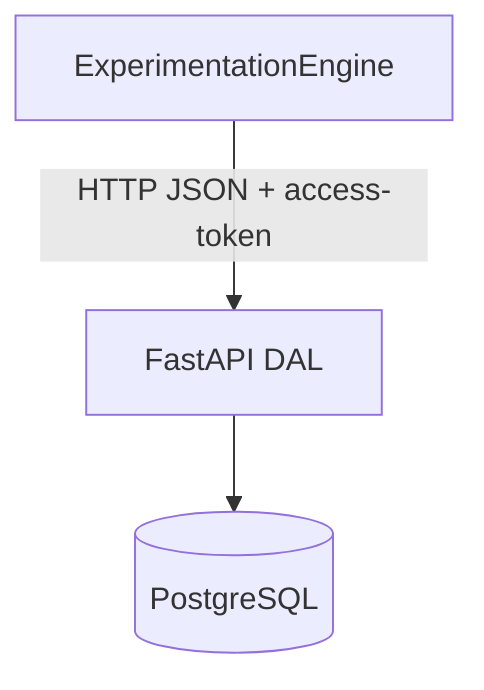
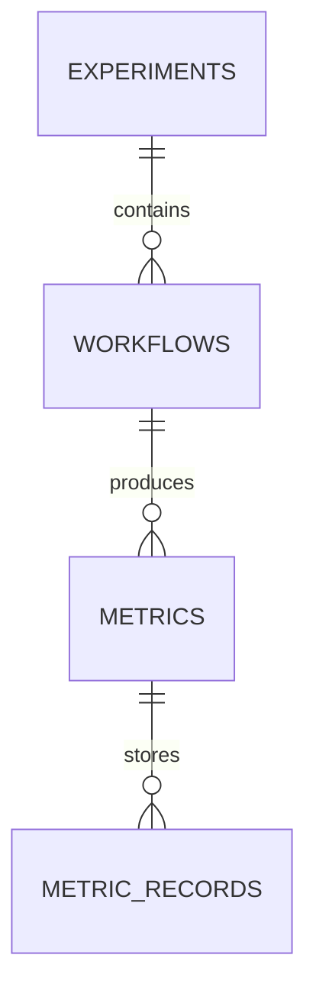
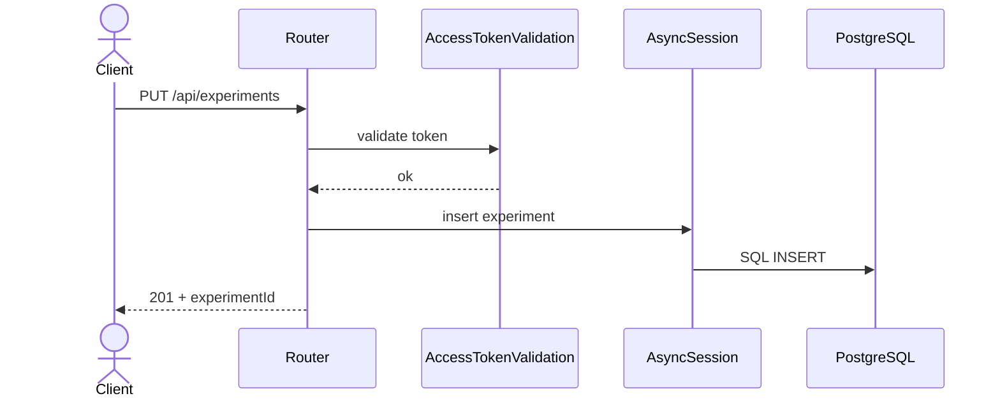

# ExtremeXP DAL Presentation Guide

Concise guide for presenting the Python DAL implementation.

## One-Minute Pitch

The DAL was implemented in Python (FastAPI + PostgreSQL) with API compatibility
for the existing Experimentation Engine. It supports experiment/workflow/metric
lifecycles and is covered by automated endpoint tests.

## Core Diagrams

### High-Level System View



### Core ERD



### End-to-End Call Sequence



## Endpoint Summary (`/api`)

- `GET /health`
- `GET /executed-experiments`
- `PUT/GET/POST /experiments...`
- `PUT/GET/POST /workflows...`
- `PUT/GET/POST /metrics...`
- `PUT /metrics-data/{metric_id}`
- `POST /experiments-query`, `/workflows-query`, `/metrics-query`

## Key Implementation Points

- Token-based auth via `access-token` header.
- Async SQLAlchemy session with commit/rollback behavior.
- Pydantic alias handling for `metadata` fields.
- Utility conversion (`orm_columns_dict`) to avoid ORM metadata collisions.

## Testing Snapshot

- Test stack: `pytest`, `pytest-asyncio`, `pytest-cov`.
- Typical command:

```bash
pytest tests/ -v --cov=dal_service.routers --cov-report=term-missing --cov-fail-under=80
```

- Coverage target and regression checks focus on router contract behavior.

## Suggested Demo Flow

1. Start DAL and PostgreSQL (Docker Compose or local).
2. Call `PUT /api/experiments`.
3. Call `PUT /api/workflows`.
4. Call `PUT /api/metrics` and `PUT /api/metrics-data/{id}`.
5. Show `GET /api/experiments` result and test output.
