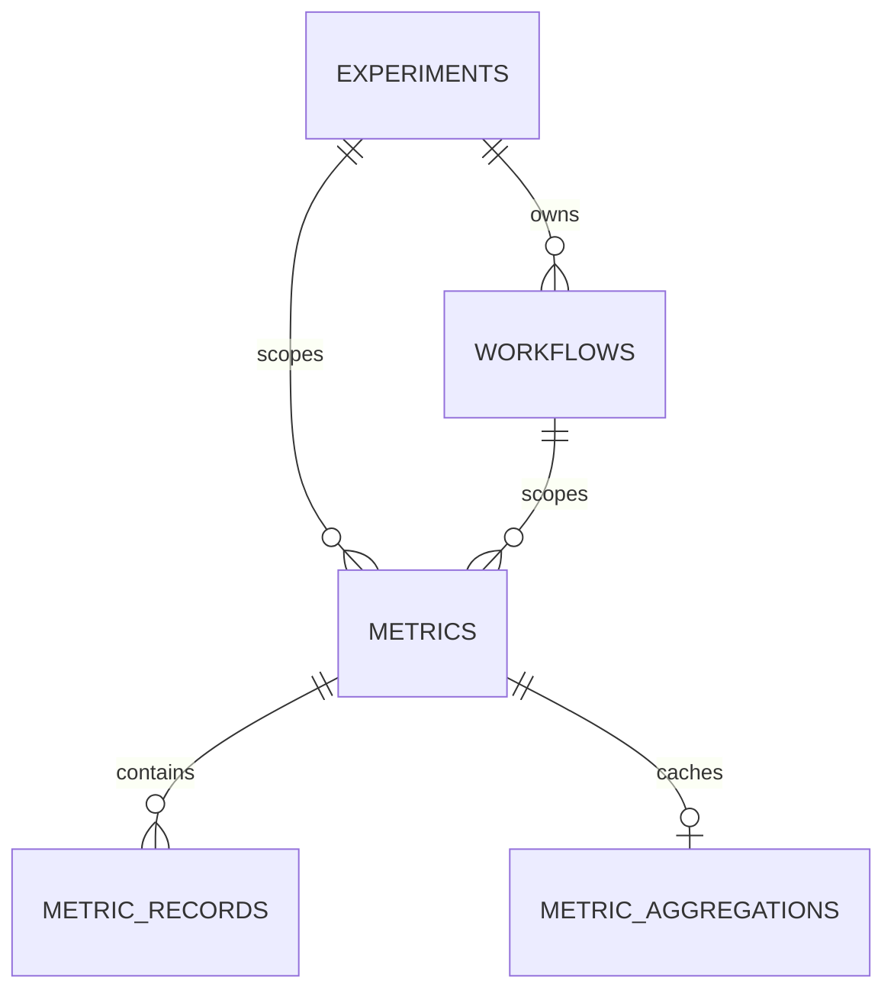
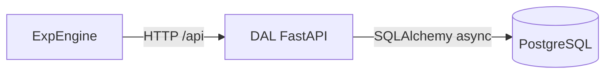

# ExtremeXP DAL Presentation Bundle

This bundle combines architecture context, API contract, schema notes, and test
evidence in a single English document.

## Scope

- NEW DAL implementation (FastAPI + PostgreSQL)
- Engine-compatible API behavior
- Operational verification with Docker and pytest

## Database Summary

Main logical tables:

- `experiments`
- `workflows`
- `metrics`
- `metric_records`
- `metric_aggregations`

Relations:



## Architecture



## API Surface (Prefix: `/api`)

| Domain | Endpoints |
|---|---|
| Health | `GET /health` |
| Experiments | `PUT /experiments`, `GET /experiments`, `GET/POST /experiments/{id}`, `GET /experiments/{id}/metrics`, `POST /experiments-query`, `GET /executed-experiments` |
| Workflows | `PUT /workflows`, `GET/POST /workflows/{id}`, `GET /workflows/{id}/metrics`, `POST /workflows-query` |
| Metrics | `PUT /metrics`, `GET/POST /metrics/{id}`, `GET /metrics/{id}/records`, `PUT /metrics-data/{id}`, `POST /metrics-query` |

## Important Compatibility Notes

- Auth header must be `access-token`.
- Legacy endpoint `GET /executed-experiments` is retained for engine compatibility.
- Response keys follow engine expectations (`experimentId`, `workflow_id`, etc.).

## Test Evidence

Recommended validation:

```bash
pytest tests/ -v --cov=dal_service.routers --cov-report=term-missing --cov-fail-under=80
```

Typical outcomes:

- Auth behavior validated (`401` missing/invalid token).
- CRUD and query contract checks for experiments/workflows/metrics.
- Metrics record ingestion and retrieval checks.

## Docker Verification Notes

Use `docker compose` with `dal` + `postgres` services and ensure:

1. Containers are up (`docker compose ps`).
2. Health endpoint returns `200`:
   - `GET /api/health`
3. Business endpoint works after schema initialization:
   - `GET /api/experiments`

## Recommended Presentation Sequence

1. Explain architecture and data model.
2. Show API compatibility with engine.
3. Run one API create/read flow.
4. Show test command and coverage output.
5. Close with Docker deployment and operational readiness.
