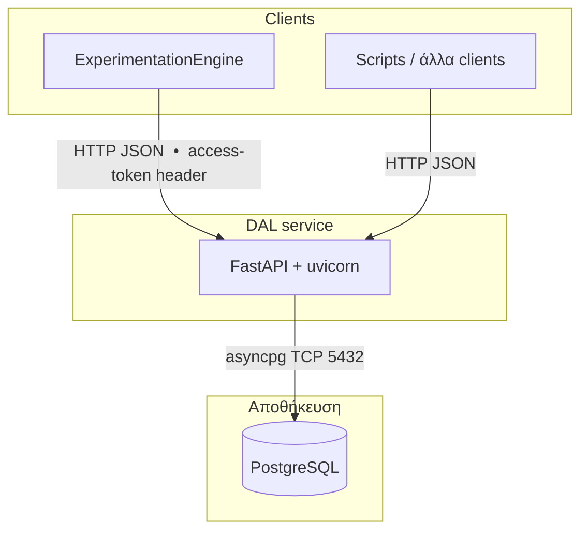
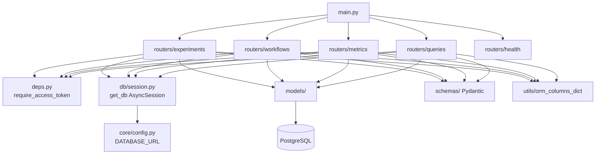
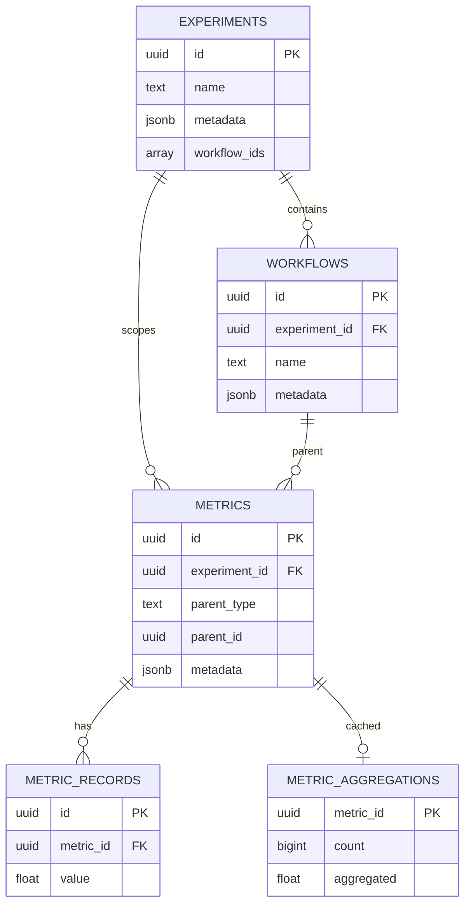
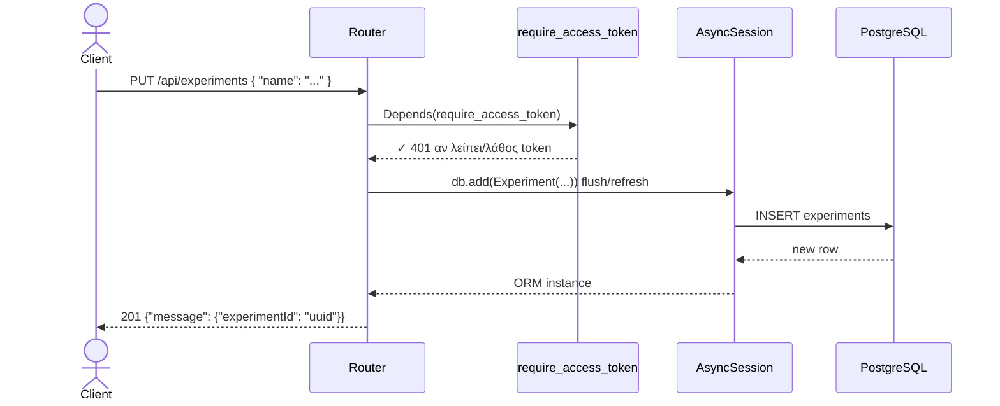

# ExtremeXP DAL — Οδηγός Παρουσίασης

Αυτό το αρχείο περιέχει **όλα όσα χρειάζεσαι** για την παρουσίαση:
narrative, διαγράμματα Mermaid, κομμάτια κώδικα, και αποτελέσματα tests.

---

## 1. Το ένα λεπτό pitch (αυτό λες πρώτο)

> Υλοποιήσαμε το **Data Abstraction Layer (DAL)** του ExtremeXP από μηδέν σε
> **Python + FastAPI + PostgreSQL**, συμβατό 100% με τον υπάρχοντα Experimentation Engine
> χωρίς καμία αλλαγή στον κώδικα του client. Καλύπτεται από automated tests με
> **97% coverage** στα REST endpoints.

---

## 2. Αρχιτεκτονικά διαγράμματα

### Α. Ποιος μιλάει με ποιον



### Β. Εσωτερικά components του `dal_service`



### Γ. Οντότητες και σχέσεις (ERD)




### Δ. Ακολουθία μιας κλήσης (end-to-end)



---

## 3. Πίνακας endpoints (prefix `/api`)

| HTTP | Endpoint | Επιστρέφει |
|------|----------|-----------|
| GET | `/health` | `{ "status": "ok" }` |
| GET | `/executed-experiments` | `{ "executed_experiments": [...] }` |
| PUT | `/experiments` | 201 `{ "message": { "experimentId": "..." } }` |
| GET | `/experiments` | `{ "experiments": [...] }` |
| GET | `/experiments/{id}` | `{ "experiment": {...} }` |
| POST | `/experiments/{id}` | Ενημέρωση |
| GET | `/experiments/{id}/metrics` | `{ "metrics": [...] }` |
| PUT | `/workflows` | 201 `{ "workflow_id": "..." }` |
| GET | `/workflows/{id}` | `{ "workflow": {...} }` |
| POST | `/workflows/{id}` | Ενημέρωση |
| GET | `/workflows/{id}/metrics` | `{ "metrics": [...] }` |
| PUT | `/metrics` | 201 `{ "metric_id": "..." }` |
| GET | `/metrics/{id}` | `{ "metric": {...} }` |
| POST | `/metrics/{id}` | Ενημέρωση |
| GET | `/metrics/{id}/records` | `{ "records": [...] }` |
| PUT | `/metrics-data/{id}` | `{ "message": "ok", "inserted": N }` |
| POST | `/experiments-query` | `[...]` |
| POST | `/workflows-query` | `[...]` |
| POST | `/metrics-query` | `[...]` |

---

## 4. Κομμάτια κώδικα για την παρουσίαση

### 4.1 Εγγραφή routers — `dal_service/main.py`

Ένα αρχείο, 17 γραμμές. Δείχνει την αρχιτεκτονική του API.

```python
# dal_service/main.py
from fastapi import FastAPI
from dal_service.routers import health, experiments, workflows, metrics, queries

app = FastAPI(title="ExtremeXP DAL", version="0.1.0")

app.include_router(health.router,                    prefix="/api")
app.include_router(experiments.router,               prefix="/api")
app.include_router(experiments.executed_router,      prefix="/api")  # GET /executed-experiments
app.include_router(workflows.router,                 prefix="/api")
app.include_router(metrics.router,                   prefix="/api")
app.include_router(metrics.metrics_data_router,      prefix="/api")  # PUT /metrics-data/{id}
app.include_router(queries.router,                   prefix="/api")
```

---

### 4.2 Authentication — `dal_service/deps.py`

Απλό και αποτελεσματικό. Ο Engine στέλνει `access-token` στο header.

```python
# dal_service/deps.py
async def require_access_token(
    access_token: str | None = Header(default=None, alias="access-token"),
) -> None:
    """401 αν λείπει ή λάθος token."""
    if not access_token or access_token != ACCESS_TOKEN:
        raise HTTPException(status_code=401, detail="Invalid or missing access-token")
```

**Σημείωση παρουσίασης:** Κάθε endpoint έχει `_: None = Depends(require_access_token)` — ένα μόνο σημείο ελέγχου.

---

### 4.3 Δημιουργία experiment — `dal_service/routers/experiments.py`

```python
@router.put("", status_code=201)
async def create_experiment(
    body: ExperimentCreate,
    db: AsyncSession = Depends(get_db),
    _: None = Depends(require_access_token),
) -> dict:
    """Create a new experiment. Returns 201 με message.experimentId."""
    attrs = body.model_dump(exclude_unset=True)
    if "status" not in attrs:
        attrs["status"] = "new"
    experiment = Experiment(**attrs)
    db.add(experiment)
    await db.flush()
    await db.refresh(experiment)
    return {"message": {"experimentId": str(experiment.id)}}
```

---

### 4.4 Engine-compatible endpoint — `GET /executed-experiments`

Ο Engine το περιμένει με αυτό ακριβώς το path και key. Χωρίς αλλαγή στον client.

```python
@executed_router.get("/executed-experiments")
async def get_executed_experiments(
    db: AsyncSession = Depends(get_db),
    _: None = Depends(require_access_token),
) -> dict:
    result = await db.execute(select(Experiment).order_by(Experiment.created_at.desc()))
    experiments = result.scalars().all()
    return {
        "executed_experiments": [
            ExperimentRead.model_validate(orm_columns_dict(e)) for e in experiments
        ]
    }
```

---

### 4.5 Αποστολή metric data — `PUT /metrics-data/{metric_id}`

Ο Engine στέλνει `{"records": [{"value": 0.11}, ...]}`. Το DAL τα αποθηκεύει στον πίνακα `metric_records`.

```python
@metrics_data_router.put("/metrics-data/{metric_id}")
async def put_metric_data(metric_id: UUID, body: dict = Body(...), db: ..., _ ...) -> dict:
    metric = (await db.execute(select(Metric).where(Metric.id == metric_id))).scalars().one_or_none()
    if metric is None:
        raise HTTPException(status_code=404, detail="Metric not found")

    inserted = 0
    for item in body.get("records", []):
        record = MetricRecord(metric_id=metric_id, value=float(item["value"]))
        db.add(record)
        inserted += 1

    await db.flush()
    return {"message": "ok", "inserted": inserted}
```

---

### 4.6 DB session με commit/rollback — `dal_service/db/session.py`

```python
async def get_db() -> AsyncGenerator[AsyncSession, None]:
    """Yield async session — commit on success, rollback on error."""
    async with AsyncSessionLocal() as session:
        try:
            yield session
            await session.commit()
        except Exception:
            await session.rollback()
            raise
        finally:
            await session.close()
```

---

### 4.7 Pydantic schema με `metadata` alias — `dal_service/schemas/experiment.py`

Πρόβλημα: το `metadata` είναι δεσμευμένο attribute του SQLAlchemy `Base`. Λύση: διαφορετικό Python name + alias.

```python
class ExperimentBase(BaseModel):
    # Python name: experiment_metadata  →  JSON key: "metadata"
    experiment_metadata: dict | None = Field(
        default=None,
        validation_alias=AliasChoices("metadata", "experiment_metadata"),
        serialization_alias="metadata",       # ← η απάντηση JSON εμφανίζει "metadata"
    )
```

---

### 4.8 `orm_columns_dict` — γιατί το χρειαζόμαστε

```python
# dal_service/utils/orm_columns.py
def orm_columns_dict(instance: object) -> dict[str, Any]:
    """Μόνο mapped στήλες — αποφεύγει το SQLAlchemy .metadata object."""
    mapper = sa_inspect(instance).mapper
    return {attr.key: getattr(instance, attr.key) for attr in mapper.column_attrs}
```

**Χωρίς αυτό:** `ExperimentRead.model_validate(experiment)` θα διάβαζε το
`experiment.metadata` που είναι **SQLAlchemy MetaData object**, όχι JSONB dict.

---

### 4.9 ORM Model με CASCADE — `dal_service/models/metrics.py` (απόσπασμα)

```python
class Metric(Base):
    __tablename__ = "metrics"

    id: Mapped[uuid.UUID] = mapped_column(UUID(as_uuid=True), primary_key=True, default=uuid.uuid4)
    experiment_id: Mapped[uuid.UUID] = mapped_column(
        UUID(as_uuid=True),
        ForeignKey("experiments.id", ondelete="CASCADE"),  # ← διαγραφή experiment → διαγραφή metrics
        nullable=False,
    )
    parent_type: Mapped[str] = mapped_column(Text, nullable=False)  # "workflow" | "experiment"
    parent_id:   Mapped[uuid.UUID] = mapped_column(UUID(as_uuid=True), nullable=False)
    kind:        Mapped[str | None] = mapped_column(Text, nullable=True)  # scalar/series/timeseries
    records:     Mapped[list] = mapped_column(JSONB, nullable=False, default=list)
```

---

## 5. Tests — δομή και αποτελέσματα

### Δομή test suite

```
tests/
├── conftest.py          # test DB, dependency override, fixtures
├── test_auth.py         # 401 χωρίς token, 401 λάθος token, ✓ σωστό token
├── test_contracts.py    # μορφή απαντήσεων, executed-experiments, metrics-data
├── test_integration.py  # experiment → workflow → metric → records (end-to-end)
└── test_router_coverage.py  # κάλυψη κάθε endpoint (404, update, query, filters)
```

### conftest.py — πώς στήνουμε τα tests

```python
# Override get_db → test database
app.dependency_overrides[get_db] = override_get_db

# Create schema once per session
@pytest_asyncio.fixture(scope="session", autouse=True)
async def prepare_schema():
    async with _test_engine.begin() as conn:
        await conn.run_sync(Base.metadata.create_all)
    yield

# Clean tables before every test
@pytest_asyncio.fixture(autouse=True)
async def clean_tables(prepare_schema):
    async with _test_engine.begin() as conn:
        await conn.execute(text(
            "TRUNCATE TABLE metric_records, metric_aggregations, metrics, workflows, "
            "experiments RESTART IDENTITY CASCADE"
        ))
    yield
```

### Integration test — πλήρης ροή

```python
async def test_metric_without_experiment_id_ingest_and_read_records(async_client, auth_headers):
    # 1. Δημιουργία experiment
    exp_id = (await async_client.put("/api/experiments", json={"name": "m-exp"}, headers=auth_headers)
              ).json()["message"]["experimentId"]

    # 2. Δημιουργία workflow
    wf_id = (await async_client.put("/api/workflows",
              json={"experiment_id": exp_id, "name": "m-wf"}, headers=auth_headers)
             ).json()["workflow_id"]

    # 3. Δημιουργία metric (χωρίς experiment_id — το DAL το βρίσκει μόνο του)
    metric_id = (await async_client.put("/api/metrics",
                  json={"parent_type": "workflow", "parent_id": wf_id, "name": "s", "kind": "series"},
                  headers=auth_headers)
                ).json()["metric_id"]

    # 4. Αποστολή τιμών
    resp = await async_client.put(f"/api/metrics-data/{metric_id}",
                                  json={"records": [{"value": 0.11}, {"value": 0.22}]},
                                  headers=auth_headers)
    assert resp.json()["inserted"] == 2

    # 5. Ανάγνωση records
    records = (await async_client.get(f"/api/metrics/{metric_id}/records",
                                       headers=auth_headers)).json()["records"]
    assert sorted(float(r["value"]) for r in records) == [0.11, 0.22]
```

### Αποτελέσματα (2026-03-30)

```
collected 35 items

tests/test_auth.py                  3 PASSED
tests/test_contracts.py             4 PASSED
tests/test_integration.py          3 PASSED
tests/test_router_coverage.py      25 PASSED

Name                                 Stmts   Miss  Cover
--------------------------------------------------------
dal_service\routers\experiments.py     69      1    99%
dal_service\routers\health.py           5      0   100%
dal_service\routers\metrics.py         86      6    93%
dal_service\routers\queries.py         88      2    98%
dal_service\routers\workflows.py       69      1    99%
--------------------------------------------------------
TOTAL                                 317     10    97%

35 passed in 8.91s
```

---

## 6. Πιθανές ερωτήσεις και απαντήσεις

**Γιατί FastAPI και όχι Flask/Django?**
> Async by default, Pydantic v2 ενσωματωμένο, αυτόματο `/docs` (OpenAPI).

**Γιατί async SQLAlchemy;**
> Μη blocking I/O — ο server δεν περιμένει idle στη βάση, εξυπηρετεί άλλα requests.

**Πώς εξασφαλίζεται συμβατότητα με τον Engine;**
> Ίδια paths (`/executed-experiments`, `/metrics-data/{id}`, κλπ), ίδια JSON keys
> (`experimentId`, `workflow_id`, `executed_experiments`), ίδιος auth header `access-token`.

**Γιατί `orm_columns_dict` και όχι `model_validate(orm_obj)` απευθείας;**
> Το SQLAlchemy `Base` έχει attribute `.metadata` που είναι `MetaData` object (σχήμα βάσης),
> όχι το JSON dict μας. Χωρίς φίλτρο το Pydantic το διαβάζει λάθος.

**Γιατί UUID και όχι integer IDs;**
> Διανεμημένη δημιουργία χωρίς κεντρική ακολουθία — αναγκαίο για microservices.

**Τι δεν υλοποιήθηκε ακόμα;**
> JWT επικύρωση υπογραφής (τώρα γίνεται string comparison), Alembic migrations,
> Docker/CI, rate limiting.

---

## 7. Δομή project (τι ανοίγεις στον editor)

```
extremexp-experimentation-engine-main/   ← ρίζα παρουσίασης
├── dal_service/
│   ├── main.py                          ← 4.1 παραπάνω
│   ├── deps.py                          ← 4.2 auth
│   ├── core/config.py
│   ├── db/session.py                    ← 4.6 get_db
│   ├── models/
│   │   ├── experiment.py
│   │   ├── workflow.py
│   │   └── metrics.py                   ← 4.9 CASCADE
│   ├── routers/
│   │   ├── experiments.py               ← 4.3 4.4
│   │   ├── workflows.py
│   │   ├── metrics.py                   ← 4.5
│   │   ├── queries.py
│   │   └── health.py
│   ├── schemas/
│   │   ├── experiment.py                ← 4.7 alias
│   │   ├── workflow.py
│   │   └── metric.py
│   └── utils/orm_columns.py             ← 4.8
├── tests/
│   ├── conftest.py
│   ├── test_auth.py
│   ├── test_contracts.py
│   ├── test_integration.py              ← 5 integration test
│   └── test_router_coverage.py
└── docs/
    ├── database_schema.sql
    ├── DAL_ARCHITECTURE.md
    └── PRESENTATION_GUIDE.md            ← αυτό το αρχείο
```

---

*Αρχείο: `docs/PRESENTATION_GUIDE.md` — δημιουργήθηκε 2026-03-30*
