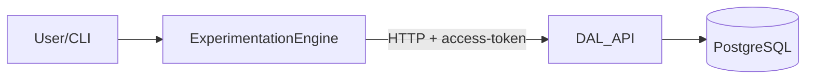

### 1. High-level overview

ExtremeXP is a framework for defining and running experiments using a DSL (Experimentation Engine), with pluggable execution backends (ExecutionWare) and a dedicated Data Abstraction Layer (DAL) for persistent storage.

- **Experimentation Engine**: parses experiment DSL, orchestrates runs, talks to DAL via HTTP.
- **ExecutionWare**: runs workflows on different platforms (local, ProActive, Kubeflow), receives workflow definitions and executes tasks.
- **DAL**: REST API responsible for storing and serving experiments, workflows, and metrics (currently Node.js + Elasticsearch, being reimplemented as Python + FastAPI + PostgreSQL).

Overall data and control flow:

### 2. Repository layout (short)

Key directories (under `extremexp-experimentation-engine-main/`):

- `exp_engine/`: Experimentation Engine source code (runner, DSL handling, ExecutionWare integration).
- `exp_engine_utils/`: shared utilities for ExecutionWare backends.
- `docs/`: documentation for Engine, ExecutionWare, and the new DAL (including this file).
- `DAL/`: legacy Node.js DAL reference (`extremexp-dal-main/`, Express routes, Elasticsearch usage).
- `.venv/` (optional): Python virtual environment for the Engine and tooling.

### 3. DAL re-implementation (Python/FastAPI/PostgreSQL)

**Goal:** replace the legacy Node.js + Elasticsearch DAL with a Python + FastAPI + PostgreSQL service, keeping the Engine API contract compatible while improving persistence, schema control, and integration with the rest of the Python stack.

Important reference docs:

- `docs/DAL_STUDY_GUIDE_NEW.md` – beginner-friendly explanation of the DAL and schema.
- `docs/DAL_OVERVIEW_AND_API_CONTRACT.md` – full architecture and API contract.
- `docs/database_schema.sql` – executable PostgreSQL DDL.
- `docs/implementation_plan.md` – phased implementation roadmap.
- `docs/critical_findings.md` – consolidated findings from analysing the legacy DAL and Engine client.

Key ideas:

- Experiments, workflows, and metrics move from Elasticsearch documents to normalized PostgreSQL tables.
- Workflow-related nested structures (parameters, tasks, input/output datasets) remain embedded as JSONB to match the original document structure and keep querying flexible.
- Metrics are first-class rows (with optional `metric_records` for large series and `metric_aggregations` for cached stats).
- The Engine continues to call the DAL over HTTP with an `access-token` header; the new service ensures responses match the shapes the Engine expects.

### 4. Database schema (PostgreSQL)

The production schema is defined in `docs/database_schema.sql`. At a high level:

- **`experiments`**
  - `id UUID PRIMARY KEY`
  - nullable descriptive fields: `name`, `intent`, `start`, `end`, `model`, `comment`, `status`
  - JSONB: `metadata`, `creator`
  - `workflow_ids UUID[]` – denormalized list of workflows belonging to this experiment
  - timestamps: `created_at`, `updated_at`

- **`workflows`**
  - `id UUID PRIMARY KEY`
  - `experiment_id UUID NOT NULL REFERENCES experiments(id) ON DELETE CASCADE`
  - basic fields: `name` (NOT NULL), `start`, `end`, `comment`, `status`
  - embedded JSONB: `parameters`, `tasks`, `input_datasets`, `output_datasets`, `metadata`
  - metric references: `metric_ids UUID[]`, `metrics JSONB` (denormalized summary)
  - timestamps: `created_at`, `updated_at`

- **`metrics`**
  - `id UUID PRIMARY KEY`
  - `experiment_id UUID NOT NULL REFERENCES experiments(id) ON DELETE CASCADE`
  - polymorphic parent: `parent_type` (`workflow` \| `experiment`), `parent_id UUID`
  - details: `name`, `kind`, `type`, `semantic_type`, `value`, `produced_by_task`, `date`
  - `records JSONB` for small/medium series or timeseries
  - `metadata JSONB`, timestamps

- **`metric_records`**
  - separate table for large series
  - `id UUID PRIMARY KEY`, `metric_id UUID REFERENCES metrics(id) ON DELETE CASCADE`
  - `value DOUBLE PRECISION`, `timestamp TIMESTAMPTZ`, `created_at`

- **`metric_aggregations`**
  - cached aggregates per metric
  - `metric_id UUID PRIMARY KEY REFERENCES metrics(id) ON DELETE CASCADE`
  - `count BIGINT`, `sum`, `min`, `max`, `average`, `median`, `updated_at`

Supervisor-aligned decisions:

- Columns like `name`, `intent`, `start`, `end`, etc. remain nullable (mirroring the legacy DAL behaviour).
- Triggers for auto-updating `updated_at` are not strictly required; logic can also live in application code or explicit queries (joins/updates).

### 5. API contract and behavior (Engine ↔ DAL)

The Engine talks to the DAL through a small client (`DataAbstractionClient`) that expects specific URLs and response shapes (see `docs/DAL_OVERVIEW_AND_API_CONTRACT.md` for full details).

Important conventions:

- **Authentication**
  - Header: `access-token: <value>` (from `DATA_ABSTRACTION_ACCESS_TOKEN`).
  - The Engine does **not** send `Authorization: Bearer ...` by default; the new DAL must at least support `access-token`.

- **Experiments**
  - `PUT /experiments` → create experiment → on success: `201` and `{ "message": { "experimentId": "<uuid>" } }`
  - `GET /experiments/{id}` → `{ "experiment": { ... } }`
  - `POST /experiments/{id}` → partial update
  - `POST /experiments-query` → filtered list
  - `GET /experiments` → paginated list (legacy behaviour)
  - `GET /executed-experiments` → semantic equivalent of listing experiments (in practice: same semantics as `GET /experiments`, but with `executed_experiments` as response key)

- **Workflows**
  - `PUT /workflows` → create workflow (requires `experimentId`), returns `{ "workflow_id": "<uuid>" }`
  - `GET /workflows/{id}` → `{ "workflow": { ... } }` (including resolved metrics if needed)
  - `POST /workflows/{id}` → partial update (status, tasks, datasets, etc.)

- **Metrics**
  - `PUT /metrics` → create metric, returns `{ "metric_id": "<uuid>" }` (legacy client ignores body but expects 201)
  - `GET /metrics/{id}` → metric plus optional `aggregation` object
  - `POST /metrics/{id}` → update metric fields
  - `PUT /metrics-data/{id}` → append records via `{ "records": [ { "value": ... }, ... ] }`

Compatibility notes:

- Response keys (`experimentId`, `workflow_id`, `executed_experiments`, `experiment`, `workflow`) must match exactly what the Engine client expects.
- The workflow sorting bug in the legacy DAL (reading `workflow_ids` but writing `workflows`) should be fixed in the new implementation by consistently using `workflow_ids` for both read and write.

### 6. Implementation plan & priorities

The detailed roadmap lives in `docs/implementation_plan.md`. In short:

- **Phase 1 – Schema & migrations**
  - Set up a dedicated `dal-service/` project with FastAPI, async SQLAlchemy, Alembic.
  - Apply the PostgreSQL schema (adapted from `database_schema.sql`) via an initial Alembic migration.
  - Verify migrations run cleanly (`alembic upgrade head`) against a local PostgreSQL instance.

- **Phase 2 – Core CRUD & auth**
  - Implement SQLAlchemy models and Pydantic v2 schemas for experiments, workflows, metrics.
  - Expose core endpoints: create/read/update experiments and workflows, plus the executed-experiments listing.
  - Enforce `access-token`-based authentication (with optional support for Bearer).
  - Ensure responses match the Engine contract exactly.

- **Phase 3 – Metrics**
  - Implement metric CRUD and the metrics-data append API.
  - Provide aggregation behaviour (either computed on read or via the `metric_aggregations` cache).

- **Phase 4 – Query & hardening**
  - Add query endpoints (experiments-query, workflows-query, metrics-query).
  - Implement fixed and consistent workflow sorting using `workflow_ids`.
  - Add rate limiting, health checks, and structured logging.

- **Phase 5 – Testing & deployment**
  - Build a pytest-based test suite (unit, contract, integration).
  - Provide Dockerfile and docker-compose for DAL + PostgreSQL.

Initial focus (as agreed in meetings) is on: experiments + workflows + executed-experiments, with metrics following next.

### 7. Testing strategy

This section captures how to validate the new DAL end to end.

- **Unit tests**
  - Test pure Python logic: validation rules (Pydantic models), aggregation functions, helper utilities.
  - Use pytest with fixtures and, where appropriate, in-memory or transactional test sessions.

- **Semantic tests**
  - Verify that the API contract matches what the Engine expects:
    - Correct URLs and HTTP methods.
    - Exact response keys (`executed_experiments`, `message.experimentId`, `workflow_id`, `experiment`, `workflow`).
    - Consistent use of `workflow_ids` for ordering.
  - These tests are about meaning/behaviour rather than just 200 vs 500.

- **Integration tests**
  - Spin up the FastAPI app against a real PostgreSQL test database (or a temporary schema).
  - Use TestClient (or httpx) to call endpoints and assert both HTTP behaviour and database state.
  - Example flows: create experiment → create workflows → query/list → verify persisted rows.

- **Postman collections**
  - Maintain a Postman collection (or HTTP client scripts) for manual testing:
    - All key endpoints (experiments, workflows, metrics, metrics-data).
    - Tests for status codes, required headers (`access-token`), and response shapes.

- **Real experiments for validation**
  - Run real Engine experiments end-to-end against the new DAL:
    - Configure `DATA_ABSTRACTION_BASE_URL` and `DATA_ABSTRACTION_ACCESS_TOKEN` to point to the new service.
    - Execute representative experiments and confirm that:
      - experiments/workflows/metrics are stored correctly,
      - Engine features (listing, viewing, updating) continue to work without modifications.

### 8. Environment & tooling notes

Development and testing should happen in a Linux-like environment to avoid Windows-specific issues:

- Use **WSL (Windows Subsystem for Linux)** when working on Windows:
  - Create and activate a Python virtual environment in WSL.
  - Install dependencies via `pip` inside WSL.
  - Run FastAPI, Alembic, and pytest from WSL shells (bash), not PowerShell.
- Run PostgreSQL either in WSL, in Docker, or on a reachable host.
- Keep all secrets (database URLs, access tokens, JWT secrets) in environment variables or `.env` files that are excluded from version control.

### 9. Meeting notes summary

Key agreements from supervisor discussions (2026-03-11 and follow-ups):

- The PostgreSQL schema with five tables (`experiments`, `workflows`, `metrics`, `metric_records`, `metric_aggregations`) is a good basis for the new DAL.
- Triggers for `updated_at` are optional; updating timestamps explicitly in the application code is acceptable.
- The `executed-experiments` behaviour should align with the semantics of listing experiments; path/rename issues in the legacy DAL should not leak into the new implementation.
- Initial milestone should deliver a working slice: create/get experiments and workflows plus an executed-experiments view that the Engine can consume.
- Future work will focus on richer metrics handling, query endpoints, and proper automated testing.

For detailed scripts and talking points, see `docs/DAL_MEETING_NOTES_2026-03-11_NEW.md`.

### 10. Open questions / TODOs for future

This section is intentionally lightweight and should be maintained manually over time.

- How strict should validation be for experiment/workflow fields (e.g. should `name` and/or `intent` become required on the new DAL even if the legacy DAL did not enforce them)?
- Do we need full support for the legacy DMS/DSL-to-JSON (`modelJSON`) in the first production version, or can it remain optional/disabled?
- What level of query expressiveness is required for experiments/workflows/metrics in practice (beyond the minimal filters already planned)?
- How will data migration from any existing Elasticsearch indices to PostgreSQL be handled in production, if required?

