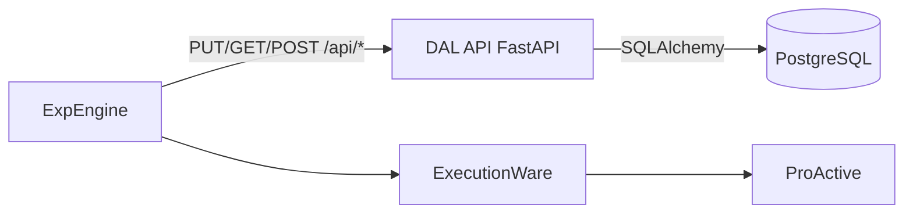
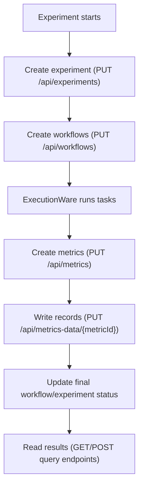
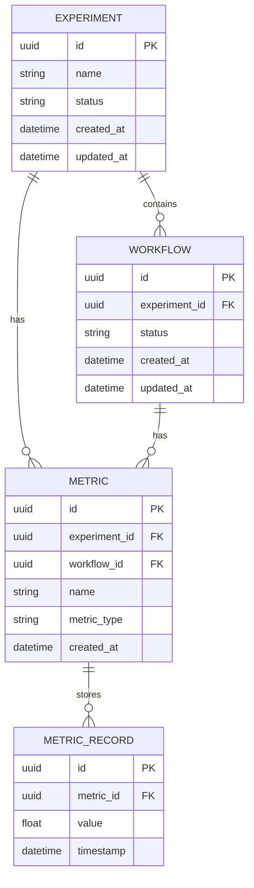

# DAL Overview (NEW DAL)

## Purpose

The NEW Data Abstraction Layer (DAL) is the persistence and query API used by ExpEngine for:

- experiment metadata
- workflow metadata and execution statuses
- metrics and metric records

It provides a consistent API surface over a PostgreSQL backend so downstream consumers can read stable execution results.

## Architecture

## Runtime flow

## Core ER Diagram

